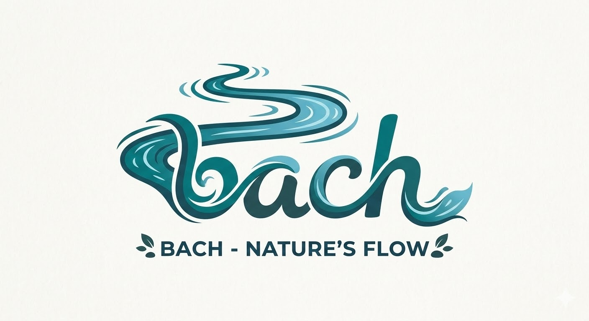
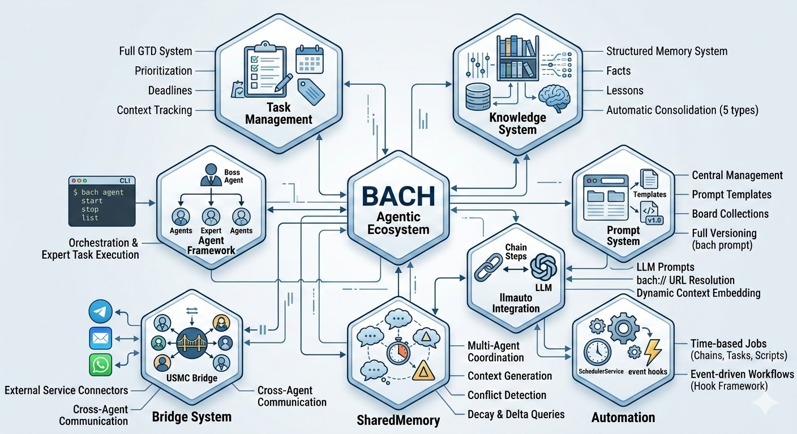
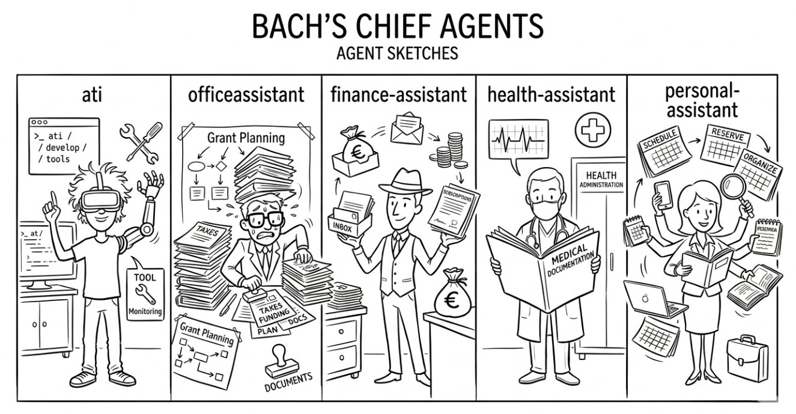

<p align="right">
  
  
</p>

# ellmos BACH - Textbasiertes Betriebssystem fuer LLMs

*Der schmale Fluss, der alles vereint.*


**Version:** v3.7.0-waterfall

<p align="center">
  
</p>

## Ueberblick

**BACH** ist ein textbasiertes Betriebssystem, das Large Language Models (LLMs) befaehigt, eigenstaendig zu arbeiten, zu lernen und sich zu organisieren. Als Teil der **ellmos**-Familie (Extra Large Language Model Operating Systems) bietet BACH eine umfassende Infrastruktur fuer Task-Management, Wissensmanagement, Automatisierung und LLM-Orchestrierung.

### Kernfunktionen

- **109+ Handler** - Vollständige CLI- und API-Abdeckung aller Systemfunktionen
- **373+ Tools** - Umfangreiche Tool-Bibliothek für Dateiverarbeitung, Analyse, Automation
- **932+ Skills** - Wiederverwendbare Workflows und Templates
- **54 Protokoll-Workflows** - Vorgefertigte Prozess-Workflows
- **Wissensspeicher** - Lessons, Facts und Multi-Level-Memory-System
- **Agent-CLI** - `bach agent start/stop/list` für direkte Agent-Steuerung
- **Prompt-System** - Zentrale Prompt-Verwaltung mit Board-System und Versionierung
- **SharedMemory-Bus** - Multi-Agent-Koordination mit Konflikt-Erkennung und Decay
- **USMC Bridge** - United Shared Memory Communication für Cross-Agent-Kommunikation
- **llmauto-Ketten** - Claude-Prompts als Chain-Steps mit `bach://` URL-Resolution

## Installation

```bash
# Repository klonen
git clone https://github.com/lukisch/bach.git
cd bach

# Abhängigkeiten installieren
pip install -r requirements.txt

# BACH initialisieren
python system/setup.py
```

## MCP-Server (Claude Code Integration)

BACH bietet zwei MCP-Server fuer die Integration mit Claude Code, Cursor und anderen IDEs:

```bash
# MCP-Server installieren und konfigurieren (empfohlen)
python system/bach.py setup mcp

# Oder manuell via npm:
npm install -g bach-codecommander-mcp bach-filecommander-mcp
```

- **[bach-codecommander-mcp](https://www.npmjs.com/package/bach-codecommander-mcp)** - Code-Analyse und Refactoring Tools
- **[bach-filecommander-mcp](https://www.npmjs.com/package/bach-filecommander-mcp)** - Datei-Management und Batch-Operationen

## Quick Start

```bash
# BACH starten
python bach.py --startup

# Task erstellen
python bach.py task add "Analysiere Projektstruktur"

# Agenten verwalten
python bach.py agent list
python bach.py agent start bueroassistent

# Prompts verwalten
python bach.py prompt list
python bach.py prompt add "Mein Prompt" --content "..."

# Scheduler-Status prüfen
python bach.py scheduler status

# BACH beenden
python bach.py --shutdown
```

## Hauptkomponenten

### 1. Task-Management
Vollständiges GTD-System mit Priorisierung, Deadlines, Tags und Context-Tracking.

### 2. Wissenssystem
Strukturiertes Memory-System mit Facts, Lessons und automatischer Konsolidierung (5 Memory-Typen).

### 3. Agenten-Framework
Boss-Agenten orchestrieren Experten für komplexe Aufgaben. Agent-CLI ermöglicht direktes Starten, Stoppen und Auflisten von Agenten über `bach agent`.

<p align="center">
  <br>
  <i>Die 5 Boss-Agenten: ati, officeassistant, finance-assistant, health-assistant, personal-assistant</i>
</p>

### 4. Prompt-System
Zentrale Verwaltung von Prompt-Templates mit Board-Sammlungen und vollständiger Versionierung (`bach prompt`).

### 5. Bridge-System
Connector-Framework für externe Services (Telegram, Email, WhatsApp, etc.) sowie USMC Bridge für Cross-Agent-Kommunikation.

### 6. Automatisierung
SchedulerService für zeitgesteuerte Jobs (Chains, Tasks, Scripts) und Event-basierte Workflows via Hook-Framework.

### 7. SharedMemory
Multi-Agent-Koordination mit Kontext-Generierung, Konflikt-Erkennung, Decay und Delta-Abfragen.

### 8. llmauto-Integration
Chain-Steps als LLM-Prompts mit `bach://`-URL-Resolution für dynamische Kontext-Einbindung.

## Die ellmos-Familie

Alle ellmos-Projekte folgen einer Gewaesser-Metapher -- von der Quelle zum Fluss:

| Stufe | Projekt | Beschreibung | Repository |
|-------|---------|-------------|------------|
| 1 | **USMC** | United Shared Memory Client -- die Quelle (nur geteiltes Memory) | [github.com/lukisch/usmc](https://github.com/lukisch/usmc) |
| 2 | **Rinnsal** | Das Rinnsal -- USMC + llmauto (LLM-Orchestrierung), extrem kompakt | [github.com/lukisch/rinnsal](https://github.com/lukisch/rinnsal) |
| 3 | **BACH** | Der schmale Fluss, der alles vereint -- 109+ Handler, 932+ Skills, Agenten, GUI, Bridge | [github.com/lukisch/bach](https://github.com/lukisch/bach) |

## Dokumentation

- **[Quickstart Guide](QUICKSTART.md)** - In 5 Minuten zum ersten Workflow
- **[User Manual](BACH_USER_MANUAL.md)** - Vollständiges Handbuch
- **[Skills Katalog](SKILLS.md)** - Alle verfügbaren Skills
- **[Agents Katalog](AGENTS.md)** - Alle verfügbaren Agenten und Experten
- **[Workflows](WORKFLOWS.md)** - 54 Protokoll-Workflows
- **[SKILL.md](SKILL.md)** - LLM-Betriebsanleitung (für Claude, Gemini, Ollama)

## Lizenz

MIT License - siehe [LICENSE](LICENSE) für Details.

## Support

- **Issues:** [GitHub Issues](https://github.com/lukisch/bach/issues)
- **Discussions:** [GitHub Discussions](https://github.com/lukisch/bach/discussions)

---

## English Version

For the English documentation, see **[README.md](README.md)**

---

*ellmos BACH v3.7.0-waterfall - Textbasiertes Betriebssystem fuer LLMs*
