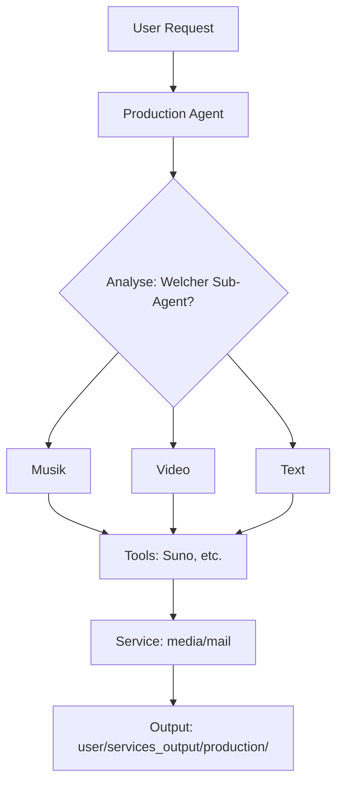

# Production (Boss-Agent)

Production Agents sind spezialisiert auf Content-Erstellung in verschiedenen Medienformaten.

## Untergeordnete Experten (Agents)

| Bereich | Beschreibung | Ordner (Plan) |
|---|---|---|
| **Musik** | Song-Generierung, Audio-Produktion | `agents/_experts/production_music/` |
| **Podcast** | Podcast-Produktion, TTS | `agents/_experts/production_podcast/` |
| **Video** | Video-Generierung, Editing | `agents/_experts/production_video/` |
| **Text** | Texterstellung, Copywriting | `agents/_experts/production_text/` |
| **Storys** | Narrative, Drehbücher | `agents/_experts/production_story/` |
| **PR** | Pressemeldungen, Marketing | `agents/_experts/production_pr/` |

## Integrierte Services

* **media** (MediaBrain Integration)
* **prompt-manager** (Content-Prompts)
* **mail** (Newsletter-Versand Update)

## Externe Tools (Nach Kategorie)

### [🎵 Musik]

* **Suno** - Song-Generierung mit Lyrics
* **Udio** - High-Fidelity Musik
* **Lalal.ai** - Stem-Separation
* **Auphonic** - Audio-Mastering

### [🎙️ Podcast]

* **ElevenLabs** - Text-to-Speech
* **Descript** - Transkription & Editing
* **Auphonic** - Normalisierung
* **Podcastle** - Remote-Aufnahme
* **NotebookLM** - Podcast aus Dokumenten

### [🎬 Video]

* **Runway Gen-3** - Text-to-Video
* **Luma Dream Machine** - Realistische Videos
* **Pika Labs** - Kreative Shorts
* **Kling AI** - Lange Clips
* **Magnific AI** - Upscaling

### [✍️ Text]

* **DeepL Write** - Stiloptimierung
* **Claude** - Long-Form Content
* **Gamma** - Präsentationen
* **Notion AI** - Dokumentation

### [📖 Storys]

* **Claude** - Narrative
* **ChatGPT** - Kreatives Schreiben
* **Midjourney** - Visualisierung

### [📢 PR]

* **Gamma** - Pressekits
* **Ideogram** - Logos & Grafiken
* **Canva** - Design (MCP)
* **DeepL Write** - Übersetzung

## Workflow-Integration



## CLI-Befehle

### Übersicht

```bash
python production_agent.py list
```

### Musik-Workflow

```bash
python production_agent.py musik --prompt "Upbeat Jazz"
```

### Video-Workflow

```bash
python production_agent.py video --prompt "Sunset timelapse"
```

### Text-Workflow

```bash
python production_agent.py text --type "blogpost" --topic "AI Trends"
```

## User-Datenordner

**Basis:** `user/production_studio/`

```text
production_studio/
├── musik/
├── video/
├── texte/
├── podcast/
└── projekte/          # Projektübergreifende Ordner
```

## Delegation

Bei komplexen Aufgaben werden externe Tools empfohlen:

| Aufgabe | Delegation |
|---|---|
| Song mit Lyrics | Suno/Udio |
| Podcast-Stimme | ElevenLabs |
| Video-Clip | Runway/Luma |
| Präsentation | Gamma/Canva |

## Status

* **Typ:** Boss-Agent
* **Version:** 1.1.0
* **Datum:** 2026-01-23
