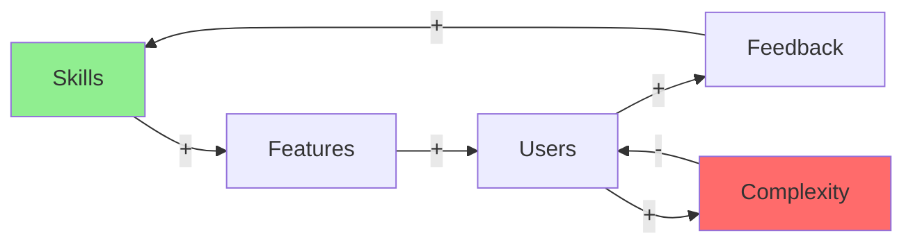
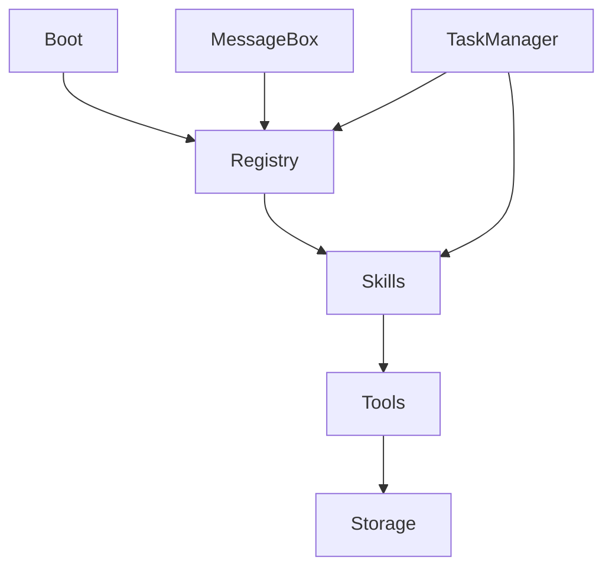

# Analyze-System Skill v1.0

**Systemisches Denken und komplexe Systeme verstehen**

## Übersicht

Der Analyze-System Skill hilft komplexe Systeme zu verstehen, Bottlenecks zu finden und Optimierungen zu identifizieren.

## Wann nutzen?

Nutze diesen Skill wenn der User:
- "Warum ist System X so komplex?" fragt
- Bottlenecks finden will
- Dependencies verstehen muss
- System optimieren will
- Feedback Loops analysieren will

**Trigger-Wörter:** system, komplex, abhängigkeiten, bottleneck, feedback, analyse

## Frameworks

### 1. Systems Thinking (Peter Senge)

**Die 5 Disziplinen:**

**Personal Mastery:**
- Individuelle Fähigkeiten
- Continuous Learning

**Mental Models:**
- Annahmen hinterfragen
- Paradigmen erkennen

**Shared Vision:**
- Gemeinsames Ziel
- Alignment

**Team Learning:**
- Kollektive Intelligenz
- Dialog

**Systems Thinking:**
- Ganzheitliche Sicht
- Zusammenhänge erkennen

**Schlüssel-Konzepte:**

**Feedback Loops:**
- Reinforcing (Positive): Verstärken
- Balancing (Negative): Stabilisieren

**Delays:**
- Zeit zwischen Aktion und Wirkung
- Oft unterschätzt

**Leverage Points:**
- Wo kleine Änderung große Wirkung hat
- Systemarchitektur, Feedback-Delays, Goal

**Beispiel RecludOS:**

```
Reinforcing Loop:
Mehr Skills → Mehr Nutzer → Mehr Feedback → Mehr Skills

Balancing Loop:
Complexity ↑ → User Confusion ↑ → Adoption ↓ → Simplification

Delay:
Skill Development → User Adoption (3-6 Monate)

Leverage Point:
Skill Discovery Mechanism (Auto-Index)
```


---

### 2. Causal Loop Diagrams

**Visualisiere Feedback-Strukturen mit Mermaid**

**Syntax:**
- `+` = Positive Relationship (mehr X → mehr Y)
- `-` = Negative Relationship (mehr X → weniger Y)
- `R` = Reinforcing Loop
- `B` = Balancing Loop

**Beispiel: RecludOS Growth**



**Analysis:**
- R1: Skills → Features → Users → Feedback → Skills (Growth Engine)
- B1: Users → Complexity → Users (Natural Brake)
- Leverage: Manage Complexity to sustain growth

---

### 3. Stock & Flow Diagrams

**Akkumulationen und Flüsse**

**Stocks (Bestände):**
- Skills Count
- User Count
- Technical Debt

**Flows (Flüsse):**
- Skill Creation Rate
- User Acquisition Rate
- Debt Accumulation Rate

**Example:**

```
[Active Users]
    ↑ (Acquisition)
    ↓ (Churn)

Net Flow = Acquisition - Churn

Wenn Acquisition > Churn → Growth
Wenn Acquisition < Churn → Decline
```

---

### 4. Dependency Mapping

**Kritische Pfade identifizieren**

**Prozess:**
1. Liste alle Komponenten
2. Identifiziere Dependencies
3. Erstelle Dependency Graph
4. Finde kritische Pfade
5. Identifiziere Circular Dependencies

**RecludOS Example:**

```mermaid
graph TD
    A[Boot] --> B[Registry]
    B --> C[Skills]
    C --> D[Tools]
    D --> B
    
    style D fill:#FFD700
    
    Note: Circular Dependency (Tools ↔ Registry)
```

**Metrics:**
- Depth (max layers): 5
- Breadth (components per layer): 3-7
- Circularity: 2 circular deps
- Critical Path: Boot → Registry → Skills

**Optimization:**
- Break circular deps
- Flatten hierarchy
- Lazy loading


---

### 5. Bottleneck Analysis (Theory of Constraints)

**Finde den limitierenden Faktor**

**5 Focusing Steps:**
1. **Identify:** Wo ist der Bottleneck?
2. **Exploit:** Maximiere Throughput
3. **Subordinate:** Alles andere anpassen
4. **Elevate:** Bottleneck beseitigen
5. **Repeat:** Nächster Bottleneck

**RecludOS Boot-Zeit Example:**

**Measure:**
```
Boot Sequence Timing:
1. System Check: 0.5s
2. Registry Load: 1.2s
3. Skill Scan: 8.3s ← BOTTLENECK!
4. Tool Init: 0.8s
5. MessageBox: 1.1s

Total: 11.9s
Bottleneck: Skill Scan (70% der Zeit)
```

**Solutions:**
- Cache skill list
- Lazy loading
- Parallel scan
- Index-based lookup

**Impact:**
```
Before: 11.9s
After (Cache): 5.2s (-58%)
After (Index): 3.1s (-74%)
```

---

### 6. Impact Analysis (Ripple Effect)

**Verstehe Auswirkungen von Änderungen**

**Process:**
1. Identify change
2. Map direct impacts
3. Map indirect impacts (2nd order)
4. Map 3rd order effects
5. Assess total impact

**Example: Change Boot Order**

```
Direct Impact:
• Registry loads before Skills
• Skills can't register during boot

2nd Order:
• Manual registration needed
• Startup errors possible

3rd Order:
• User confusion
• Support tickets ↑
• Adoption ↓

Risk Assessment: HIGH
Recommendation: Don't change!
```

---

## Verwendungsbeispiele

### Beispiel 1: RecludOS Complexity Analysis

**User:** "Warum ist RecludOS so komplex?"

**Analyze-System Process:**

**1. Component Identification:**
- Boot System
- Registry
- Skills (32+)
- Tools (12+)
- MessageBox
- Task Manager
- Storage DBs

**2. Dependency Graph:**


**3. Complexity Metrics:**
- Components: 12 major
- Dependencies: 18 direct
- Circular Deps: 2
- Max Depth: 5 levels
- Config Files: 8

**4. Complexity Score: 7/10**

**5. Root Causes:**
- Config Sprawl (8 files)
- Circular Dependencies
- Deep Nesting
- No unified interface

**6. Simplification Strategy:**
- Merge configs → 3 files
- Break circular deps
- Flatten to 3 levels max
- Create facade layer

**Impact:**
- Complexity: 7/10 → 4/10
- Onboarding: -50% time
- Maintenance: -40% effort


---

### Beispiel 2: Performance Bottleneck

**User:** "Warum ist RecludOS so langsam beim Start?"

**Bottleneck Analysis:**

**Timing:**
```
Component         Time    %
Boot Init         0.5s    4%
Registry Load     1.2s    10%
Skill Scan        8.3s    70% ← BOTTLENECK
Tool Discovery    0.8s    7%
MessageBox Init   1.1s    9%
----------------------------
TOTAL            11.9s   100%
```

**Root Cause:**
- Sequential file scanning
- No caching
- Regex parsing on every file
- No indexing

**Solutions:**
```
1. Cache (Easy):
   → Store last scan results
   → Impact: -60% (4.8s)

2. Index (Medium):
   → SQLite index of skills
   → Impact: -75% (3.0s)

3. Parallel (Hard):
   → Multi-threaded scan
   → Impact: -80% (2.4s)
```

**Recommendation:** Start with Cache, then Index

---

## Best Practices

### 1. Start Simple
- Don't overcomplicate analysis
- Focus on obvious bottlenecks first
- Add complexity only if needed

### 2. ALWAYS Visualize
- Mermaid diagrams for structures
- Metrics in tables
- Before/After comparisons

### 3. Quantify Everything
- Use metrics, not feelings
- Measure before optimization
- Measure after to verify

### 4. Multiple Frameworks
- Different problems need different tools
- Combine approaches
- Cross-validate findings

### 5. Consider 2nd Order Effects
- Direct impacts are obvious
- Indirect impacts often bigger
- Think systems, not components

## Integration mit anderen Skills

### **analyze-system + brainstorm:**
```
User: "Wie vereinfachen wir RecludOS?"

1. analyze-system: Complexity Analysis
2. brainstorm: Simplification Ideas
3. Output: Refactoring Plan
```

### **analyze-system + decide:**
```
User: "Welche Optimierung zuerst?"

1. analyze-system: Bottleneck Identification
2. decide: Impact vs Effort Matrix
3. Output: Prioritized Optimization Roadmap
```

## Workflow

```
1. User Request
   ↓
2. Identify System Scope
   ↓
3. Select Framework
   ↓
4. Map Components
   ↓
5. Analyze Dependencies
   ↓
6. Find Bottlenecks/Issues
   ↓
7. Visualize (Mermaid)
   ↓
8. Recommend Solutions
```

## RecludOS Integration

**MessageBox Trigger:**
- "system", "komplex", "abhängigkeiten", "bottleneck"

**Output:**
- `Workspace/System_Analyses/analysis_YYYY-MM-DD.md`
- Mermaid diagrams included

**Metrics:**
- Complexity Score (0-10)
- Dependency Depth
- Circular Dependencies Count
- Bottleneck Timing

## Version History

**v1.0 (2025-12-27):**
- 6 Frameworks implemented
- Mermaid visualization
- Metrics-driven analysis
- Bottleneck identification

---

**Skill Type:** ACT (Think)  
**Priority:** P3  
**Status:** Active  
**Created:** 2025-12-27
