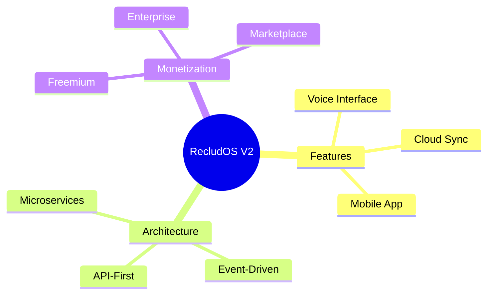

# Brainstorm Skill v1.0

**Strukturierte Kreativität für Innovation**

## Übersicht

Der Brainstorm Skill ermöglicht systematische Ideenfindung durch bewährte Kreativitätsmethoden.

## Wann nutzen?

Nutze diesen Skill wenn der User:
- "Brainstorme..." sagt
- Neue Ideen braucht
- Festgefahren ist
- Innovation sucht
- Problem kreativ lösen will

**Trigger-Wörter:** brainstorm, ideen, kreativ, innovativ, ideenfindung

## Methoden

### 1. SCAMPER

**Substitute, Combine, Adapt, Modify, Put to other use, Eliminate, Reverse**

**Verwendung:** Bestehende Lösungen verbessern

**Framework:**
- **S**ubstitute: Was kann ersetzt werden?
- **C**ombine: Was kann kombiniert werden?
- **A**dapt: Was kann angepasst werden?
- **M**odify: Was kann verändert werden?
- **P**ut to other use: Wofür sonst nutzen?
- **E**liminate: Was kann weggelassen werden?
- **R**everse: Was kann umgekehrt werden?

**Beispiel: RecludOS verbessern**

```
S - Substitute:
• CLI → GUI Interface
• JSON → YAML Configs
• Python → Rust (Performance)

C - Combine:
• Skill + Tool = Hybrid Component
• Multiple Skills = Workflow-Chain
• RecludOS + Gemini = Distributed System

A - Adapt:
• Linux-Konzepte für Windows
• Gaming-UI für Productivity
• Chat-Interface für System-Control

M - Modify:
• Text-Files → Database
• Manual → Auto-Update
• Single-User → Multi-User

P - Put to other use:
• Skills als Plugins verkaufen
• RecludOS als Enterprise Tool
• Personal Assistant → Team Assistant

E - Eliminate:
• Config-Sprawl → Unified Config
• Manual Skill-Loading → Auto-Discovery
• Complex Boot → Simple Start

R - Reverse:
• User commands System → System suggests to User
• Skills read Files → Files trigger Skills
• Linear Workflow → Parallel Processing
```

**Output:** 20+ konkrete Ideen in 10 Min


---

### 2. Six Thinking Hats (Edward de Bono)

**6 Perspektiven systematisch durchdenken**

**Verwendung:** Multiple Blickwinkel auf Problem/Idee

**Die 6 Hüte:**

**🤍 White Hat - Fakten**
- Welche Informationen haben wir?
- Was fehlt noch?
- Objektive Daten

**❤️ Red Hat - Emotion**
- Wie fühlt sich das an?
- Intuition, Bauchgefühl
- Emotionale Reaktion

**🖤 Black Hat - Kritik**
- Was könnte schiefgehen?
- Risiken, Schwächen
- Devil's Advocate

**💛 Yellow Hat - Optimismus**
- Was sind die Chancen?
- Best Case Scenario
- Positive Aspekte

**💚 Green Hat - Kreativität**
- Was sind neue Ideen?
- Alternatives, Verrücktes
- Out-of-the-box

**🔵 Blue Hat - Meta**
- Prozess-Kontrolle
- Zusammenfassung
- Nächste Schritte

**Prozess:**
1. Problem definieren (Blue)
2. Fakten sammeln (White)
3. Emotionen äußern (Red)
4. Kritik sammeln (Black)
5. Positives finden (Yellow)
6. Neue Ideen generieren (Green)
7. Zusammenfassen (Blue)

**Best for:**
- Team-Brainstorming
- Komplexe Probleme
- Diverse Perspektiven

---

### 3. Mind Mapping

**Visualisiere Gedanken hierarchisch**

**Verwendung:** Themen strukturieren und explorieren

**Mermaid Integration:**


**Prozess:**
1. Zentrales Thema
2. Haupt-Äste (3-7)
3. Sub-Äste für jede Kategorie
4. Details und Ideen hinzufügen
5. Verbindungen erkennen

---

### 4. Reverse Brainstorming

**Problem umkehren: "Wie machen wir es SCHLIMMER?"**

**Verwendung:** Indirekt Lösungen finden

**Prozess:**
1. Problem umkehren
   - Original: "Wie machen wir RecludOS benutzerfreundlich?"
   - Reverse: "Wie machen wir RecludOS UNBENUTZERFREUNDLICH?"

2. Schlechte Ideen sammeln:
   - Komplexe Befehle
   - Keine Dokumentation
   - Cryptische Fehlermeldungen
   - Random Boot-Reihenfolge
   - Keine Beispiele

3. Umkehren = Gute Ideen:
   - ✅ Einfache Befehle
   - ✅ Umfassende Doku
   - ✅ Hilfreiche Errors
   - ✅ Deterministische Boot
   - ✅ Viele Examples

**Best for:**
- Wenn direkte Ideenfindung stockt
- Humor als Kreativitäts-Boost
- Problem aus neuem Winkel sehen


---

### 5. TRIZ (Theory of Inventive Problem Solving)

**40 Inventive Principles - systematische Innovation**

**Top 10 Principles für Software:**

1. **Segmentation:** Teile Monolith in Module
2. **Extraction:** Isoliere störende Eigenschaft
3. **Local Quality:** Verschiedene Komponenten, verschiedene Eigenschaften
4. **Asymmetry:** Nicht-symmetrische Designs
5. **Merging:** Kombiniere ähnliche Funktionen
6. **Universality:** Ein Element, mehrere Funktionen
7. **Nesting:** Komponenten ineinander
8. **Preliminary Action:** Vorbereitung im Voraus
9. **Feedback:** Monitoring und Anpassung
10. **Self-Service:** System wartet sich selbst

**Beispiel: RecludOS Boot-Speed**

Problem: Boot dauert 15 Sekunden

Principle #8 (Preliminary Action):
→ Skills pre-cachen beim Herunterfahren
→ Boot-Zeit: 3 Sekunden!

Principle #6 (Universality):
→ Boot-System auch für Updates nutzen
→ Unified Update-Mechanism

---

### 6. Rapid Ideation

**Quantity over Quality - 50+ Ideen in 20 Min**

**Regeln:**
- ✅ KEINE Kritik während Ideation
- ✅ WILDE Ideen willkommen
- ✅ Auf Ideen anderer aufbauen
- ✅ Quantität FIRST

**Timer-basiert:**
- Runde 1 (5 Min): Offene Ideation
- Runde 2 (5 Min): Variationen
- Runde 3 (5 Min): Kombinationen
- Runde 4 (5 Min): Extreme Ideen

**Output:**
- 50-100 rohe Ideen
- Clustering nach Themen
- Top 10 auswählen
- Feasibility bewerten

---

## Verwendungsbeispiele

### Beispiel 1: RecludOS V2 Features

**User:** "Brainstorme Features für RecludOS V2"

**Methode:** SCAMPER + Rapid Ideation

**Prozess:**
1. SCAMPER für bestehende Features (15 Min)
2. Rapid Ideation für neue Kategorien (10 Min)
3. Clustering (5 Min)
4. Feasibility/Impact Matrix (10 Min)

**Output (Top 10):**

| Feature | Impact | Feasibility | Priority |
|---------|--------|-------------|----------|
| Cloud Sync | High | Medium | P1 |
| Voice Interface | High | Low | P2 |
| Mobile App | Medium | Medium | P2 |
| Skill Marketplace | High | High | P1 |
| Team Collaboration | Medium | Low | P3 |
| Auto-Backup | High | High | P1 |
| Plugin System | Medium | High | P2 |
| Web Interface | High | Medium | P2 |
| AI Auto-Fix | Medium | Low | P3 |
| Version Control | High | High | P1 |

**Empfehlung:**
- Q1 2026: Cloud Sync, Auto-Backup, Skill Marketplace, Version Control
- Q2 2026: Voice Interface, Web Interface, Plugin System


---

### Beispiel 2: Problem lösen

**User:** "Wie reduzieren wir RecludOS Komplexität?"

**Methode:** Reverse Brainstorming + Six Hats

**Reverse:**
"Wie machen wir RecludOS NOCH komplexer?"
- Mehr Config-Files
- Tiefere Verschachtelung
- Circular Dependencies
- Cryptische Naming

**Umkehren:**
- ✅ Unified Config
- ✅ Flache Hierarchie
- ✅ Break Circular Deps
- ✅ Clear Naming

**Six Hats Analysis:**
- White: Current complexity score = 7/10
- Red: Feels overwhelming
- Black: Risk of user abandonment
- Yellow: Simplification = more users
- Green: Merge configs, visual editor
- Blue: Action plan created

---

## Best Practices

### 1. "Yes, and..." Mindset
- Niemals "Ja, aber..."
- Auf Ideen aufbauen
- Kritik kommt später

### 2. Quantity first, Quality later
- Erst 50+ Ideen sammeln
- Dann filtern
- Dann verfeinern

### 3. Diverse Methoden
- Verschiedene Techniken kombinieren
- Different perspectives
- Avoid getting stuck

### 4. Visualisierung nutzen
- Mind Maps (Mermaid)
- Matrices
- Clustering

### 5. Zeitlimit setzen
- Parkinson's Law
- 5-10 Min pro Runde
- Fokus erzwingen

## Integration mit anderen Skills

### **brainstorm + decide:**
```
User: "Welches Feature zuerst bauen?"

1. brainstorm: 30+ Feature-Ideen
2. decide: Eisenhower Matrix Priorisierung
3. Output: Roadmap
```

### **brainstorm + analyze-system:**
```
User: "Wie reduzieren wir Systemkomplexität?"

1. brainstorm: Simplification-Ideen (Reverse Brainstorming)
2. analyze-system: Dependency Analysis
3. Output: Refactoring Plan
```

## Workflow

```
1. User Request
   ↓
2. Understand Goal
   ↓
3. Select Method(s)
   ↓
4. Generate Ideas (No Criticism!)
   ↓
5. Clustering
   ↓
6. Feasibility/Impact Matrix
   ↓
7. Top 5-10 Selection
   ↓
8. Output + Recommendation
```

## RecludOS Integration

**MessageBox Trigger:**
- "brainstorm", "ideen", "kreativ"

**Output:**
- `Workspace/Brainstorms/brainstorm_YYYY-MM-DD.md`

**Optional Mermaid:**
- Mind Maps als .mermaid files

## Version History

**v1.0 (2025-12-27):**
- 6 Methods implemented
- Mermaid integration
- Quality guidelines

---

**Skill Type:** ACT (Think)  
**Priority:** P2  
**Status:** Active  
**Created:** 2025-12-27
