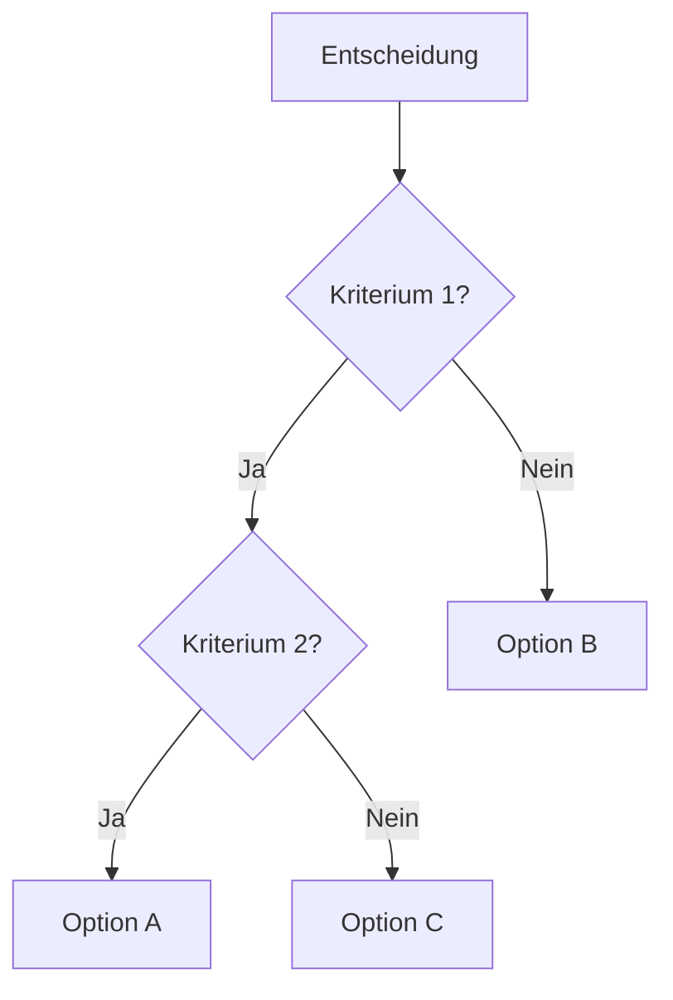

# Decide Skill v1.0

**Strukturierte Entscheidungsfindung**

## Übersicht

Der Decide Skill hilft bei rationalen Entscheidungen durch strukturierte Frameworks und Bewertungsmethoden.

## Wann nutzen?

Nutze diesen Skill wenn der User:
- "Soll ich X oder Y wählen?" fragt
- Zwischen Optionen entscheiden muss
- Pro/Con Liste braucht
- Mehrkriterien-Entscheidung hat
- Unsicher bei wichtigen Entscheidungen ist

**Trigger-Wörter:** entscheiden, wählen, vergleichen, evaluieren, abwägen

## Frameworks

### 1. Pro/Con Matrix (einfach)

**Verwendung:** Schnelle Entscheidungen zwischen 2 Optionen

**Template:**
```
Option A vs Option B

PRO A:
- Vorteil 1
- Vorteil 2
- Vorteil 3

CON A:
- Nachteil 1
- Nachteil 2

PRO B:
- Vorteil 1
- Vorteil 2

CON B:
- Nachteil 1
- Nachteil 2
- Nachteil 3

Empfehlung: [A/B] weil [Begründung]
```

**Best for:**
- Binäre Entscheidungen
- Wenn Zeit knapp ist
- Emotionale Klärung

---

### 2. Weighted Scoring (komplex)

**Verwendung:** Multi-Kriterien Entscheidungen mit Gewichtung

**Template:**
```
| Kriterium | Gewicht | Option A | Score A | Option B | Score B |
|-----------|---------|----------|---------|----------|---------|
| Kriterium 1 | 30% | 8 | 2.4 | 6 | 1.8 |
| Kriterium 2 | 25% | 7 | 1.75 | 9 | 2.25 |
| Kriterium 3 | 20% | 9 | 1.8 | 7 | 1.4 |
| Kriterium 4 | 15% | 6 | 0.9 | 8 | 1.2 |
| Kriterium 5 | 10% | 7 | 0.7 | 6 | 0.6 |
|-----------|---------|----------|---------|----------|---------|
| TOTAL | 100% | - | 7.55 | - | 7.25 |

Empfehlung: Option A (Score: 7.55 > 7.25)
```

**Prozess:**
1. Kriterien sammeln
2. Gewichte festlegen (Summe = 100%)
3. Optionen bewerten (1-10 Skala)
4. Scores berechnen (Bewertung × Gewicht)
5. Vergleichen und empfehlen

**Best for:**
- Komplexe Entscheidungen
- Multiple Stakeholder
- Wenn Objektivität wichtig ist


---

### 3. Decision Tree (sequenziell)

**Verwendung:** Entscheidungen mit klaren Wenn-Dann-Pfaden

**Mermaid Visualisierung:**


**Prozess:**
1. Start-Frage definieren
2. Erste Verzweigung (wichtigstes Kriterium)
3. Nächste Ebene (zweitwichtigstes)
4. Bis zu finaler Option

**Best for:**
- Sequenzielle Entscheidungen
- Klare Ja/Nein Kriterien
- Komplexe Abhängigkeiten

---

### 4. Scenario Analysis (Unsicherheit)

**Verwendung:** Wenn Ausgang unsicher ist

**Template:**
```
Option A:

Best Case (30% Wahrscheinlichkeit):
- Ereignis X tritt ein
- Ergebnis: +10 Punkte
- Erwartungswert: +3

Realistic Case (50% Wahrscheinlichkeit):
- Ereignis Y tritt ein
- Ergebnis: +5 Punkte
- Erwartungswert: +2.5

Worst Case (20% Wahrscheinlichkeit):
- Ereignis Z tritt ein
- Ergebnis: -5 Punkte
- Erwartungswert: -1

Gesamt-Erwartungswert: +4.5
Risk-Adjusted Score: 7/10

Option B:
[... gleiche Analyse]

Empfehlung: Option mit höchstem Erwartungswert
```

**Best for:**
- Risikobewertung
- Business-Entscheidungen
- Unsichere Zukunft

---

### 5. Eisenhower Matrix (Priorisierung)

**Verwendung:** Aufgaben/Optionen priorisieren

**Template:**
```
        DRINGEND
     JA    |    NEIN
  ---|---------|--------
 D | 1. TUN  | 2. PLANEN
 R |         |
 I |---------|----------
 N | 3. DELE-| 4. ELIMI-
 G | GIEREN  | NIEREN

1. Tun (Urgent + Important):
   - Task A
   - Task B

2. Planen (Important, Not Urgent):
   - Task C
   - Task D

3. Delegieren (Urgent, Not Important):
   - Task E

4. Eliminieren (Neither):
   - Task F
```

**Best for:**
- Task-Priorisierung
- Zeitmanagement
- Mehrere konkurrierende Optionen


---

## Verwendungsbeispiele

### Beispiel 1: Job-Entscheidung

**User:** "Soll ich Job A (Startup) oder Job B (Konzern) nehmen?"

**Prozess:**
1. **Kriterien erfragen:**
   - Gehalt
   - Karrierechancen
   - Work-Life Balance
   - Lernmöglichkeiten
   - Stabilität

2. **Gewichte festlegen:**
   - Karriere: 30%
   - Gehalt: 25%
   - Work-Life: 20%
   - Lernen: 15%
   - Stabilität: 10%

3. **Weighted Scoring:**

| Kriterium | Gewicht | Startup | Score | Konzern | Score |
|-----------|---------|---------|-------|---------|-------|
| Karriere | 30% | 9 | 2.7 | 6 | 1.8 |
| Gehalt | 25% | 6 | 1.5 | 9 | 2.25 |
| Work-Life | 20% | 5 | 1.0 | 8 | 1.6 |
| Lernen | 15% | 10 | 1.5 | 7 | 1.05 |
| Stabilität | 10% | 4 | 0.4 | 9 | 0.9 |
| TOTAL | 100% | - | 7.1 | - | 7.6 |

**Empfehlung:** Konzern (7.6 > 7.1)

**ABER:** Bias-Check (via meta-think):
- Recency Bias? (Konzern-Offer gestern bekommen)
- Anchoring? (Gehalt überbewertet)

**Adjusted:** 
- Langfristige Karriere wichtiger
- Startup = 7.8, Konzern = 7.2
- NEUE Empfehlung: Startup!

---

### Beispiel 2: Feature-Priorisierung

**User:** "Welches Feature sollte ich zuerst bauen?"

**Optionen:**
- A: Voice Interface
- B: Cloud Sync
- C: Mobile App

**Eisenhower Matrix:**

```
        IMPACT
     HIGH  |   LOW
  ---|---------|--------
 E | A,B     | 
 F |         |
 F |---------|----------
 O | C       | 
 R |         |
 T |         |
```

**Weighted Scoring:**

| Kriterium | Gewicht | Voice | Cloud | Mobile |
|-----------|---------|-------|-------|--------|
| User Need | 40% | 7 | 9 | 6 |
| Effort | 30% | 3 | 7 | 4 |
| Impact | 30% | 9 | 8 | 7 |

**Empfehlung:**
1. Cloud Sync (höchster Score)
2. Voice Interface (High Impact)
3. Mobile App (Nice-to-have)

**Roadmap:**
- Q1: Cloud Sync
- Q2: Voice Interface
- Q3: Mobile App


---

## Quality Checklist

Vor finaler Empfehlung prüfen:

- [ ] **Alle relevanten Kriterien** identifiziert?
- [ ] **User-Werte** berücksichtigt?
- [ ] **Langfristige Auswirkungen** bedacht?
- [ ] **Risiken** identifiziert und bewertet?
- [ ] **Bias-Check** durchgeführt (via meta-think)?
- [ ] **Stakeholder** berücksichtigt?
- [ ] **Reversibilität** geprüft? (Kann man zurück?)

## Integration mit anderen Skills

### **decide + research:**
```
User: "Soll ich RecludOS öffentlich machen?"

1. research: Market Analysis (Competitor, Trends, User-Need)
2. decide: Weighted Scoring basierend auf Research-Daten
3. Output: Data-driven Decision
```

### **decide + meta-think:**
```
User: "Soll ich Feature X priorisieren?"

1. decide: Weighted Scoring
2. meta-think: Bias-Check (Planning Fallacy? Sunk Cost?)
3. decide: Adjusted Recommendation
```

### **brainstorm + decide:**
```
User: "Welche Features bauen?"

1. brainstorm: 20+ Feature-Ideen
2. decide: Eisenhower Matrix Priorisierung
3. Output: Priorisierte Roadmap
```

## Best Practices

### 1. Kriterien definieren
- Spezifisch und messbar
- User-Werte berücksichtigen
- Nicht zu viele (3-7 ideal)
- Unabhängig voneinander

### 2. Gewichtung
- Summe = 100%
- Wichtigstes Kriterium ≥ 25%
- Keine Gewichte < 5%
- User validieren lassen

### 3. Bewertung
- 1-10 Skala (konsistent)
- Objektive Daten wo möglich
- Mehrere Perspektiven
- Bias-Check einbauen

### 4. Empfehlung
- Klar und begründet
- Alternativen erwähnen
- Risiken benennen
- Reversibilität beachten

## Workflow

```
1. User Request
   ↓
2. Understand Decision
   ↓
3. Identify Options (2-5)
   ↓
4. Select Framework
   ↓
5. Gather Criteria
   ↓
6. Apply Framework
   ↓
7. Bias-Check (optional)
   ↓
8. Make Recommendation
   ↓
9. Document Reasoning
```

## RecludOS Integration

**MessageBox Trigger:**
- "entscheiden", "wählen", "vergleichen"
- Auto-activate decide skill

**Output:**
- `Workspace/Decisions/decision_YYYY-MM-DD.md`

**Task Manager:**
```json
{
  "id": "decision-001",
  "title": "Job Choice Analysis",
  "skill": "act/think/decide",
  "framework": "weighted_scoring",
  "status": "complete"
}
```

## Version History

**v1.0 (2025-12-27):**
- Initial implementation
- 5 Frameworks implemented
- Quality checklist defined
- Integration with meta-think

---

**Skill Type:** ACT (Think)  
**Priority:** P2  
**Status:** Active  
**Created:** 2025-12-27
